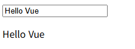
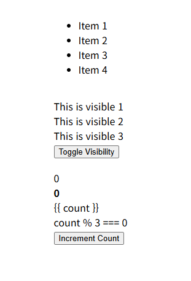
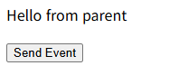
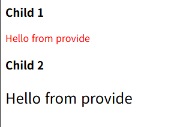
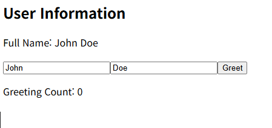
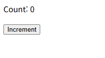
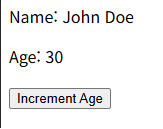
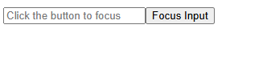
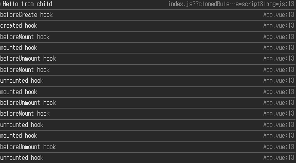

# what is changed?

## 공통 변경점
```

1. data()로 반환하지 않고, ref/reactive/computed로 선언
2. option api -> composition api로 변경
```

## example1



```

1. data(){ return { message } } -> const message = ref('Vue!') 등, 선언이 짧아짐
2. computed를 뒤로 분리
```

## example2

```

1. isVisible, items, count를 ref로 전환
```

## example3

```

props와 emit의 사용방법 변경
1. props: ['message'] 
-> const props = defineProps({ message: { type: String, required: true } })

2. $emit('custom-event', payload) 
-> const emit = defineEmits(['custom-event']) 선언 후 emit('custom-event', payload)

자식 등록 방식, 상태/메서드 변경
1. components: { ChildComponent }
-> <script setup>에서 import ChildComponent from './ChildComponent.vue'

2. data(){ return { parentMessage: '...' } }, methods:{ handleEvent(){} }
-> const parentMessage = ref('...'), function handleEvent(...) { ... }

```

## example4

```


```

## example5

```

```

## example6



```

```

## 과제가 끝난 뒤의 콘솔


# vue-demo

## Project setup
```
npm install
```

### Compiles and hot-reloads for development
```
npm run serve
```

### Compiles and minifies for production
```
npm run build
```

### Lints and fixes files
```
npm run lint
```

### Customize configuration
See [Configuration Reference](https://cli.vuejs.org/config/).
